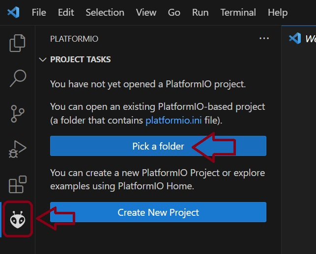

=== TBD: This needs to be filled in more ===

# Background

_Add some background and description of the overall Git project._

High level design and project breakdown
  - __Primary controller__: Contains the code that runs on the single primary controller.  This controller connects to and manages the individual sign elements.  It also exposes the main Bluetooth service that connects to the Android phone app.
  - __Secondary controller__: Contains the code that runs on the controllers that operate the LEDs for indidual signs.
  - __Common lib__: Contains code shared by both the Primary and Secondary controllers.

# Very rough instructions for developing

Prerequisites:
  - [VSCode](https://code.visualstudio.com/Download)
  - [PlatformIO](https://docs.platformio.org/en/latest/integration/ide/vscode.html) plugin

Clone the repository

Steps to open the project
  - Using the Platform IO extension, select "Pick a folder"
    
  - Select to the `LargeLedSign\PrimaryController` or `LargeLedSign\SecondaryController` folder as appropriate

At this point, you'll be able to build and deploy the Arduino code.  If you intend to do development work, it's recommended that you also add the common libary folder and save the workspace so you have easy access to it in the future.

To add the common library and create a workspace:
  - Go to "File" / "Add Folder to Workspace..."
  - Select the `LargeLedSign\lib` folder
  - To save the workspace, go to "File" / "Save Worspace As..."
  - Save the workspace whereever you like.  Git has been told to ignore *.code-workspace files, so feel free to save the workspace directly under `LargeLedSign\PrimaryController` or `LargeLedSign\SecondaryController`.
  - Optional, but recommended: PlatformIO will successfully build the project, but VSCode's intellisense will be confused for files in the common `lib` folder.  To get VSCode to behave correctly, copy the file `LargeLedSign\PrimaryController\.vscode\c_cpp_properties.json` to `LargeLedSign\lib\.vscode\c_cpp_properties.json`.